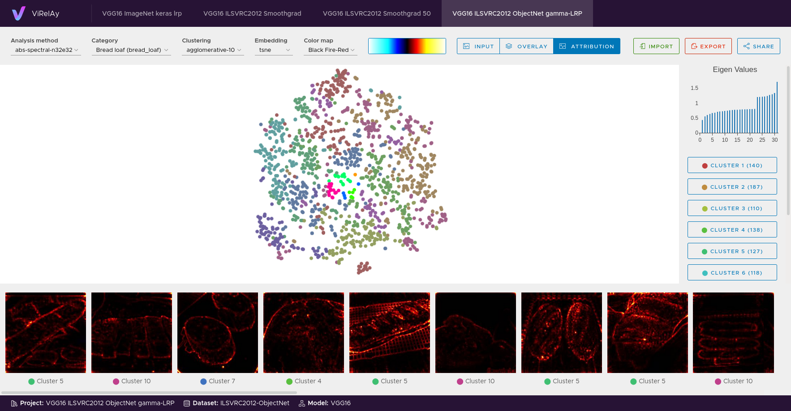

# Visualizing Relevance Analysis (ViRelAy)


ViRelAy is a visualization tool for the analysis of data as generated by **CoRelAy**.
It runs a small website to view and interact with data representations using clusterings and
(t-SNE-) embeddings, the corresponding source data and an auxilary per-sample representation (i.e. the attribution).
With this, ViRelAy attempts to simplify the analysis of classifiers and their underlying datasets.
Currently, only image data is supported, and the auxilary representation is expected to be an attribution with the same shape as the input.

If you find ViRelAy useful for your research, why no cite our related [paper](https://arxiv.org/abs/1912.11425v2):
```
@article{anders2020finding,
  author    = {Christopher J. Anders and
               Leander Weber and
               David Neumann and
               Wojciech Samek and
               Klaus{-}Robert M{\"{u}}ller and
               Sebastian Lapuschkin},
  title     = {Finding and Removing Clever Hans:
               Using Explanation Methods to Debug and Improve Deep Models},
  journal   = {CoRR},
  volume    = {abs/1912.11425v2},
  year      = {2020},
  url       = {http://arxiv.org/abs/1912.11425v2},
  archivePrefix = {arXiv},
  eprint    = {1912.11425v2},
}
```

## Install
```sh
$ pip install 'git+git://github.com/virelay/virelay'
```

## Running in a Standalone WSGI Container
To run ViRelAy for actual use, the user is advised to run flask using a WSGI container.
The application can be run e.g. with Gunicorn (`pip install gunicorn`) using:

```shell
$ gunicorn -w 4 -b 127.0.0.1:8080 \
    "virelay.application:create_app(projects=['path/to/project1.yaml', 'project2.yaml'])"
```
With the above, the server binds to 127.0.0.1 on port 8080 and uses 4 worker processes.

Alternatively, the environment variable `VIRELAY_PROJECTS` may be used to specify the project paths:
```shell
$ export VIRELAY_PROJECTS="path/to/project1.yaml:project2.yaml"
$ gunicorn -w 4 -b 127.0.0.1:8080 "virelay.application:create_app()"
```

Passing the the projects explicitly to `create_app()` takes precedence over the
environment variable, i.e. if `create_app(projects=...)` is used,
`VIRELAY_PROJECTS` is ignored.


## Sequential-only development command-line interface
The (slow) development command-line interface is defined as following:

```sh
$ virelay --help
usage: virelay [-h] [-H HOST] [-p PORT] [-d] project [project ...]

The visualization tool ViRelAy.

positional arguments:
  project               The project file that is to be loaded into the
                        workspace. Multiple project files can be specified.

optional arguments:
  -h, --help            show this help message and exit
  -H HOST, --host HOST  The name or IP address at which the server should run.
                        Defaults to "localhost".
  -p PORT, --port PORT  The port at which the server should run. Defaults to
                        8080.
  -d, --debug-mode      Determines whether the application is run in debug
                        mode. When the application is in debug mode, all FLASK
                        and Werkzeug logs are printed to stdout, FLASK
                        debugging is activated (FLASK will print out the
                        debugger PIN for attaching the debugger), and
                        automatic reloading (when files change) is activated.
                        Furthermore, the frontend of the application will not
                        be served by flask and instead has to be served
                        externally (e.g. via ng serve).
```


## Project Files
Project files are described in [YAML](https://yaml.org/).
Multiple project files may be supplied on the command line.
A project file may look like the [following](docs/example/project-ilsvrc2012-sg.yaml):

```yaml
project:
  name: VGG16 ILSVRC2012-small SG
  model: VGG16
  label_map: datasets/ilsvrc2012/label-map-keras.json
  dataset:
    name: ILSVRC2012-small
    type: hdf5
    path: datasets/ilsvrc2012/ilsvrc2012-small.input.h5
    input_width: 224
    input_height: 224
    down_sampling_method: none
    up_sampling_method: none
  attributions:
    attribution_method: smoothgrad
    attribution_strategy: true_label
    sources:
      - ilsvrc2012-small-sg/attribution/ilsvrc2012-small.smoothgrad.h5
  analyses:
    - analysis_method: spectral_analysis
      sources:
        - ilsvrc2012-small-sg/analysis/ilsvrc2012-small.smoothgrad.h5
```

Paths are relative to the project file. HDF5 files are structured as described in [docs/database_specifications.md](docs/database_specifications.md).
An example how to structure hdf5 file for use with virelay is shown in [docs/example/hdf5_structure.py](docs/example/hdf5_structure.py).
An example for a label map is given in [docs/example/label-map-ilsvrc2012.json](docs/example/label-map-ilsvrc2012.json)

## Development
ViRelAy consists of 2 parts, the backend written in Python using Flask, and the frontend implemented using Angular.
A production-ready version of the frontend is included in the repository, so it can be directly served by Flask.
In case the frontend needs to be compiled, first the dependencies need to be installed using:
```shell
$ cd virelay/frontend
$ npm install
```

Then the frontend may be compiled with:
```shell
$ node_modules/@angular/cli/bin/ng build --prod
```
where the `--prod` flag introduces optimizations for production and may be omitted during development.
The frontend's static files are produced in `virelay/frontend/distribution` and may then be served.

Alternatively, during development, instead
```shell
$ node_modules/@angular/cli/bin/ng serve
```
can be used for debugging purposes.
